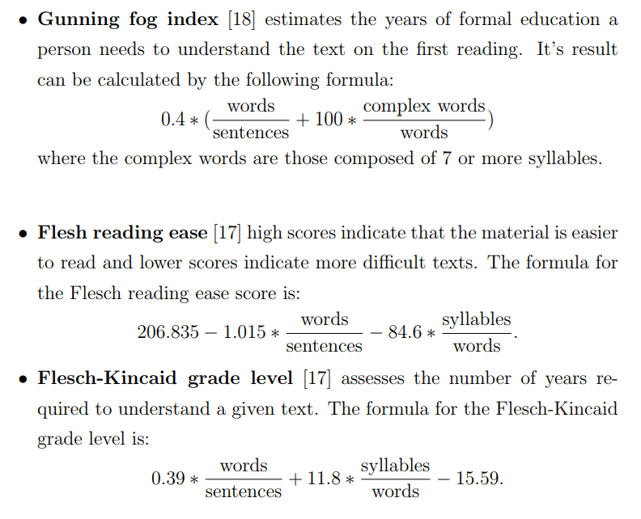

# match
## Matching readers with text through readability assessment.
### Abstract
* Classifying text according to its (readability|difficulty|complexity) we use those 3 words interchangeably.
> What is [readability](https://en.wikipedia.org/wiki/Readability)?  
> Readability is the ease with which a reader can understand a written text. 
> السلاسة في القراءة او عدمها 
* The task of assessing the reading difficulty is a well studied problem for the last century.
### Related work
* There are a lot formulas that measure the readability like

* Flesch-Kincaid grade level is so popular, It is used in Windows Microsoft Word application.
---
> What is the problem with those formulas?  
* Focus on only on sentence length and word difficulty 
* Formulas generally assume that longer words are harder words and longer sentences are harder sentences. They can’t tell you whether the words you are using are familiar to your readers or whether the sentences you have written are clear and cohesive.
---
> How are we going to solve this problem?
* We are going to use a learning model that learn the sentence structure of articles regardless of the topic that the article is talking about.
* We are going to optimize our model using neural network.
---
> Data Set
* OneStopEnglish Corpus
* 189 * 3 articles
* Our corpus was compiled from onestopenglish.com over the period 2013–2016.
* onestopenglish.com is an English language learning resources website run by MacMillan Education, with over 700,000 users across 100 countries. 
* One of the features of the website is a weekly news lessons section, which contains articles sourced from The Guardian newspaper, and rewritten by teachers to suit three levels of adult ESL learners (elementary, intermediate, and advanced). That is, content from the same original article is rewritten in three versions, to suit three reading levels. 
* The advanced version is close to the original article.
___
### Other
> Why neural network?  
> Capable of learning representation for groups of sequences without being explicitly told about existence of such group.
___
> What could cause a low accuracy? 
* A small dataset
___
> What should we take care about in neural network?
* High training accuracy implies good optimization among the seen data.
* High validation accuracy implies good generalization among unseen data.
* We need to balance both of accuracies to avoid over fitting and under fitting
---
> Convolution Neural Network
* We are using a 1 dimensional convolution layer followed by max pool layer.
* *One-dimensional-layer* can recognize local patterns in a sequence.
* Using window size of 5 should be able to learn words or word fragments of 5 or less
* *Max-pooling-layer* extract patches from input and output the maximum value.
* This is used for reducing length of input (down sampling)

---
> Steps for applying neural network
* Now we have 33% of data of class Beginner, 33% of data of class Intermediate and 33% of data of class Advanced.
* So our baseline accuracy is 33% because the probability of picking a random class is (number of desired outcome/number of all outcomes).
* So the model accuracy should start on 33%
* the next table illustrate the cycle of tuning parameters and watching accuracy and loss until reaching our acceptable result.
